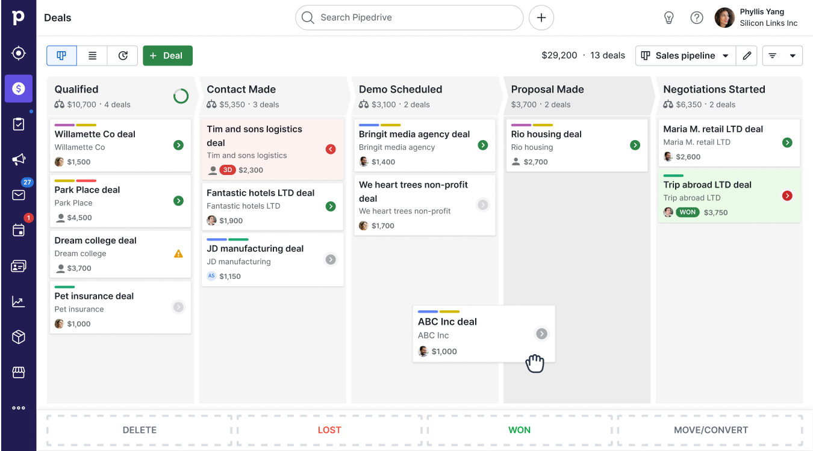
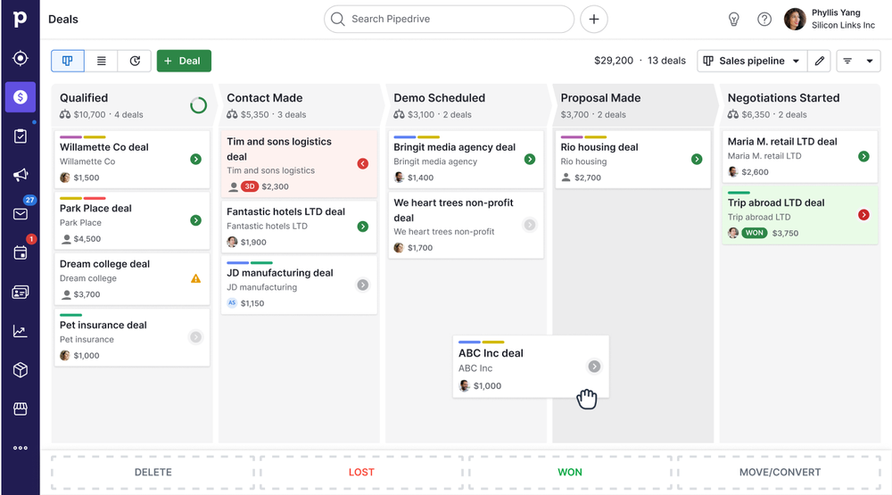
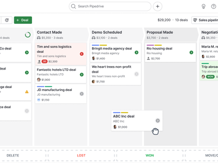
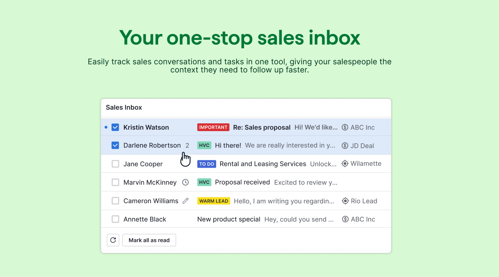
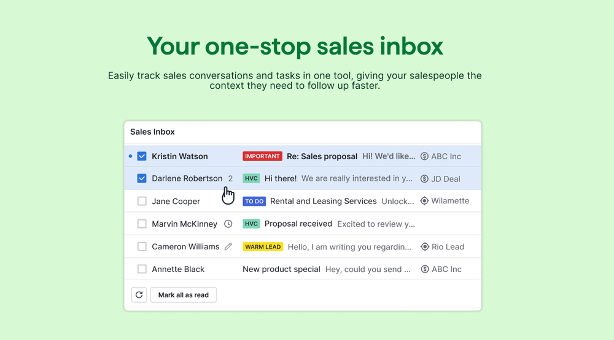
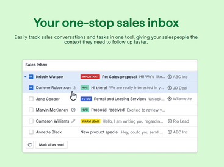

# Pipedrive

**Learn about Pipedrive.**

 

### 

[**Visit Pipedrive on SOFTGIT**](https://softgit.pro/p/pipedrive) · [Browse apps](https://softgit.pro)

---

## Overview

Learn about Pipedrive.

Learn about Pipedrive. Read Pipedrive reviews from real users, and view pricing and features of the CRM software

## At a glance

- Category: Business
- Publisher / site: pipedrive.com
- Listing tag: Free trial
- Official site (from listing): https://www.pipedrive.com/
- Source listing: https://sourceforge.net/software/product/Pipedrive/
- Type: Business / SaaS listing (information page)

## Screenshots

  
  
  
  
  
  

## System / listing information

| Field | Value |
|---|---|
| Name | Pipedrive |
| Category | Business |
| Publisher | pipedrive.com |
| Platform | Any |
| License / offer | Free trial |
| Updated | October 6, 2026 |
| Listed package size | 1.1 MB |

## How to get started

1. Open the [Pipedrive page on SOFTGIT](https://softgit.pro/p/pipedrive).
2. Review the overview, screenshots, and any official website link on that page.
3. Use the page CTA to visit the vendor site or request access / trial as offered there.
4. This GitHub repo is an informational listing only — it does not host SaaS installers or account credentials.

[**Visit Pipedrive on SOFTGIT**](https://softgit.pro/p/pipedrive)

## FAQ

**What is this repository?**  
An unofficial information page for Pipedrive, with links to the [SOFTGIT listing](https://softgit.pro/p/pipedrive).

**Is software redistributed here?**  
No. SaaS products are used via the vendor’s website or apps. Do not treat any third-party zip on a listing as the product itself without verifying the source.

**Who owns this product?**  
Third-party software/service, all rights belong to the original authors and trademark owners. This repo is not affiliated with them.

---

[**Visit Pipedrive**](https://softgit.pro/p/pipedrive) · [SOFTGIT](https://softgit.pro)

Third-party software/service, all rights belong to the original authors. Unofficial listing for Pipedrive.

